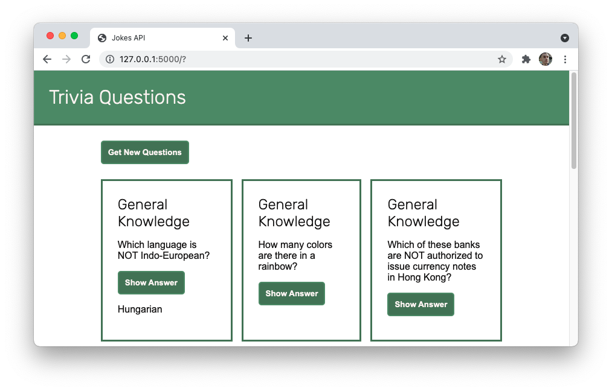

# API Calls with Fetch

I've built a trivia application that makes use of the [Open Trivia Database](https://opentdb.com/api_config.php).



[Open Trivia Database](https://opentdb.com/api_config.php),  provides data to update the form so that when it is submitted 10 new trivia questions appear on the page.

Using the following HTML format for each trivia question. The application replaces the text with the relevant values from the API.

```html
<article class="card">
  <h2>CATEGORY</h2>
  <p>QUESTION</p>
  <button>Show Answer</button>
  <p class="hidden">CORRECT ANSWER</p>
</article>
```
Clicking the Show Answer button reveals the correct answer.

my link to index    - [Trivia Questions](https://jmoncayo-pursuit.github.io/API-Calls-with-Fetch/)

Future Updates:

- Decoding characters 

- [ ] The API returns a "difficulty" key which categorizes the question based on how difficult it is. Display this difficult on the page through both text and CSS. For example, you may change the border color of the `.card` element to yellow if it is a medium difficulty question.

- [ ] Add a dropdown to the form so that the user can select what category they'd like for their questions. When the form is submitted, update the API call so that only those types of questions are retrieved.

- [ ] The multiple choice questions include a series of incorrect answers in addition to the correct answer. Update your web application so that all of the answers are displayed. Then, have the button click highlight the correct answer with CSS.
